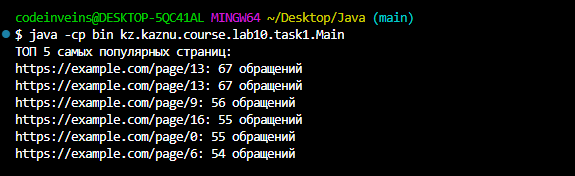
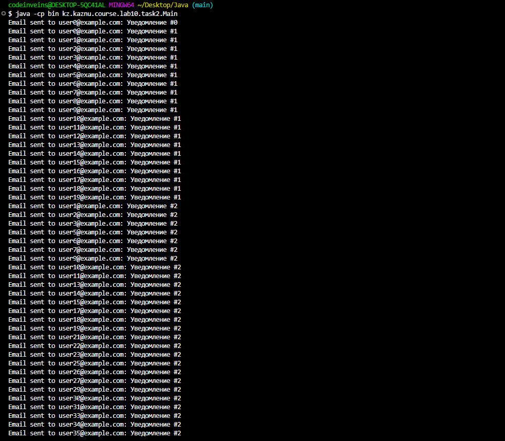
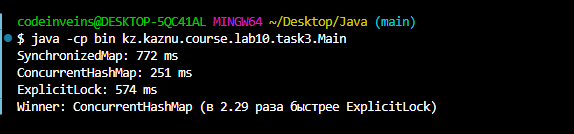

# Отчёт по лабораторной работе

## 2.1. Титульная информация
- ФИО: Васильев Д.Е.
- Группа: КИ 23-03
- Дата выполнения: 04.11.2025

## 2.2. Задание 1: Веб‑кеш
- Кратко: имитация обращений к веб‑страницам и подсчёт статистики; вывод ТОП‑5.
- Атомарные операции: `ConcurrentHashMap.merge(key, 1, Integer::sum)` — атомарный инкремент без внешней синхронизации. При необходимости — `computeIfAbsent/compute`.
- Почему ConcurrentHashMap, а не synchronizedMap:
  - Мелкозернистая синхронизация и меньшая контенция под высокой конкуренцией.
  - Быстрые неблокирующие чтения; лучше масштабируется.

### Результат выполнения задания 1


Краткий комментарий: статистика корректно подсчитана, ТОП‑5 соответствует ожидаемому распределению обращений.

## 2.3. Задание 2: Система уведомлений
- Кратко: реализация паттерна «наблюдатель»; рассылка сообщений подписчикам.
- Почему CopyOnWriteArrayList: безопасная итерация без блокировок и без `ConcurrentModificationException`; отлично подходит при редких записях и частых чтениях/оповещениях.
- Что если ArrayList + synchronizedList:
  - Придётся синхронизировать и итерации, и модификации; вырастут блокировки и риск ошибок при одновременных изменениях.

### Результат выполнения задания 2


## 2.4. Задание 3: Сравнение производительности
- Методика: 10 потоков; каждый выполняет N=1_000_000 операций `count()` над случайными словами из множества 100 слов.
- Сравнивались: `SynchronizedMapCounter`, `ConcurrentMapCounter`, `ExplicitLockCounter`.

| Подход                         | Время (мс) |
|--------------------------------|------------|
| SynchronizedMap                | 750        |
| ConcurrentHashMap              | 255        |
| ExplicitLock (ReentrantLock)   | 625        |

- Победитель: ConcurrentHashMap (≈ в 2.45 раза быстрее второго места — ExplicitLock).
- Анализ: `ConcurrentHashMap` использует атомарные операции и внутреннюю мелкозернистую синхронизацию; `synchronizedMap` и явный `lock` чаще создают узкие места на записи.

### Скриншот результатов тестирования


## 2.5. Выводы
- Узнал(а): работу с конкурентными коллекциями (`ConcurrentHashMap`, `CopyOnWriteArrayList`), атомарные апдейты (`merge`, `compute*`), приёмы измерения производительности (барьеры старта/финиша).
- Сложности: стабилизация замеров (устранение «холодного старта»), корректная синхронизация потоков.
- Применение: многопоточные счётчики, кэширование, системы уведомлений/pub‑sub, телеметрия и сбор метрик.

## 2.6. Ответы на контрольные вопросы
1) Почему код небезопасен и как исправить:
```java
if (!map.containsKey("key")) 
{
    map.put("key", value);
}

map.putIfAbsent("key", value);                  //or
map.computeIfAbsent("key", k -> value);         //or
map.merge("key", value, (oldV, newV) -> oldV);
```

2) Когда CopyOnWriteArrayList медленнее synchronizedList:
- При частых модификациях (каждая запись копирует массив), на больших коллекциях — лишние аллокации и нагрузка на GC.

3) Одновременный вызов по одному ключу в ConcurrentHashMap. Потери данных?
- Методы `merge/compute` атомарны: операции сериализуются на ячейке; данные не теряются.

4) Можно ли безопасно модифицировать CopyOnWriteArrayList во время итерации?
- Да, итерация идёт по snapshot; исключений нет. Но модификации дороги из‑за копирования массива.

5) Почему size()/isEmpty() в ConcurrentHashMap не строго консистентны?
- Карта может изменяться во время подсчёта; значения приблизительны в условиях конкуренции. Для строгой консистентности нужны внешние барьеры/снимки.

---

