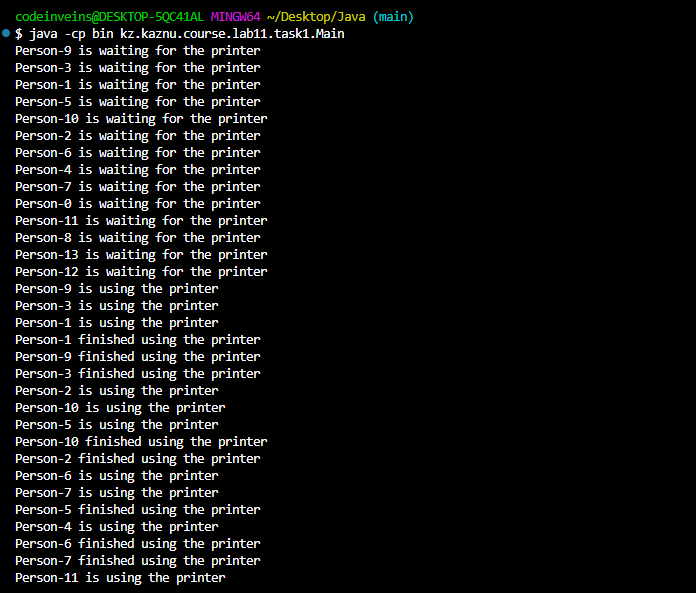
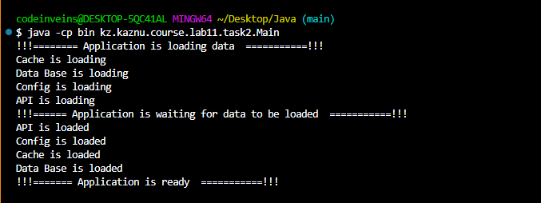
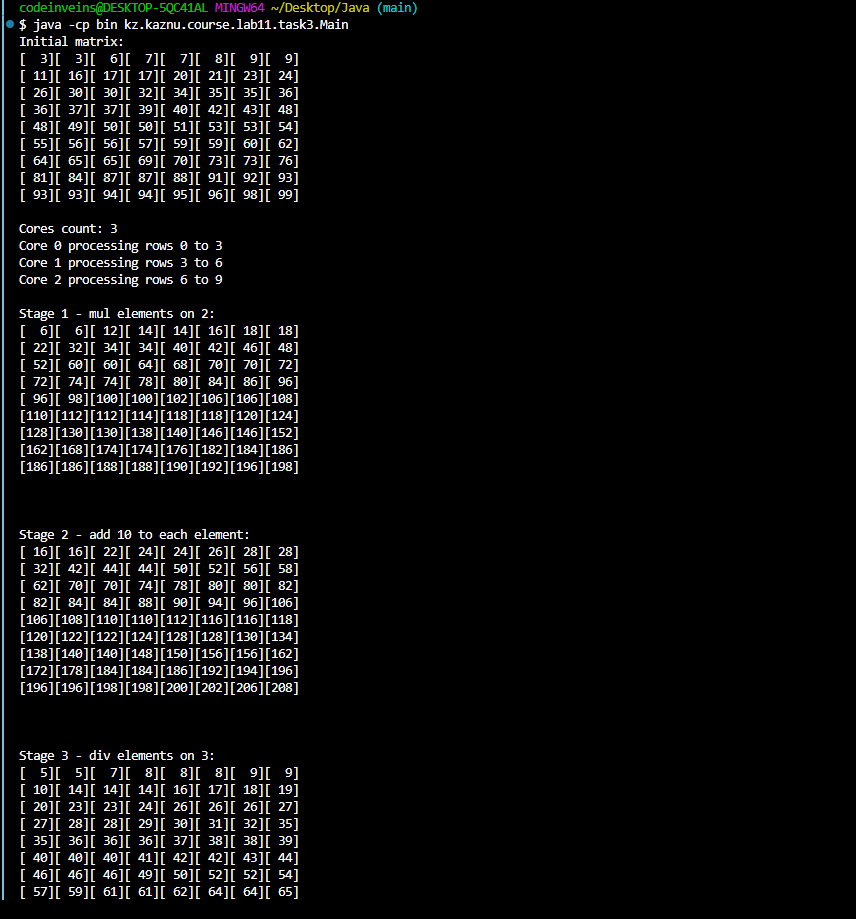

# Лабораторная работа 11: Синхронизаторы в Java

**Студент:** Васильев Д.Е.

**Группа:** КИ 23-03

**Дата:** 11.11.2025

## Описание работы

Цель лабораторной работы — изучить и практически применить основные синхронизаторы из пакета `java.util.concurrent`: `Semaphore`, `CountDownLatch`, `CyclicBarrier`. В заданиях реализованы типовые сценарии многопоточного взаимодействия, где требуется ограничение доступа к ресурсам, ожидание завершения подзадач и поэтапная синхронизация потоков.

## Выполненные задания

### Задание 1: Semaphore — Управление принтерами

Классическая задача ограничения одновременного доступа к ограниченному числу ресурсов.

**Краткое описание задачи**
  Система управления доступом к 3 принтерам для случайного числа сотрудников (5–14 потоков).

**Какой синхронизатор использован**
  `Semaphore` с 3 разрешениями и режимом справедливости (`new Semaphore(3, true)`).

**Ключевые моменты реализации**
  - Инициализация семафора на 3 разрешения, что соответствует количеству принтеров.
  - Каждая задача печати вызывается методом `usePrinter(name)` из `PrinterManager`.
  - Получение разрешения через `semaphore.acquire()` и освобождение в `finally` через `semaphore.release()`.
  - Имитируется печать задержкой `Thread.sleep(1000)`.

 

### Задание 2: CountDownLatch — Инициализация модулей приложения

Главный поток ожидает завершение загрузки всех независимых модулей.

**Краткое описание задачи**
  Четыре подзадачи загружают: Data Base, Config, Cache, API. Приложение стартует только после готовности всех модулей.

**Какой синхронизатор использован**
  `CountDownLatch` с начальными значением 4.

**Ключевые моменты реализации**
  - В `Main` создаётся `CountDownLatch(4)` и запускаются 4 потока `DataLoader`.
  - Каждый загрузчик имитирует работу случайной задержкой 1–4 секунды и затем вызывает `countDown()`.
  - Главный поток вызывает `latch.await()` и продолжает только после завершения всех загрузчиков.

 

### Задание 3: CyclicBarrier — Многопоточная обработка матрицы по стадиям

Параллельная обработка матрицы с барьером и общей барьерной операцией после каждого этапа.

**Краткое описание задачи**
  Матрица сначала сортируется для удобства наблюдения, затем обрабатывается несколькими потоками-"ядрами" в 3 стадии: умножение на 2, прибавление 10, деление на 3. После каждой стадии барьер печатает текущую матрицу.

**Какой синхронизатор использован**
  `CyclicBarrier` с числом участников = количеству потоков-"ядер" и барьерным действием печати стадии и матрицы.

**Ключевые моменты реализации**
  - Количество ядер случайно выбирается в диапазоне 2–5.
  - Строки матрицы поровну распределяются между потоками, остаток распределяется по одному на первые потоки.
  - После каждой стадии вызывается `barrier.await()`, барьерное действие синхронно выводит стадию и состояние матрицы.

 

## Выводы
  На практике рассмотрены различия и сценарии применения `Semaphore`, `CountDownLatch`, `CyclicBarrier`. Закреплены навыки распределения работы между потоками и поэтапной синхронизации.
  Корректно рассчитывать распределение нагрузки по потокам и не забывать об обязательном освобождении ресурсов (`release()`), а также об обработке `InterruptedException` и согласованном выводе.
  Ограничение доступа к пулу ресурсов (подключения, устройства), запуск основного сервиса после готовности зависимостей, барьерная синхронизация этапов в конвейерной обработке данных.
