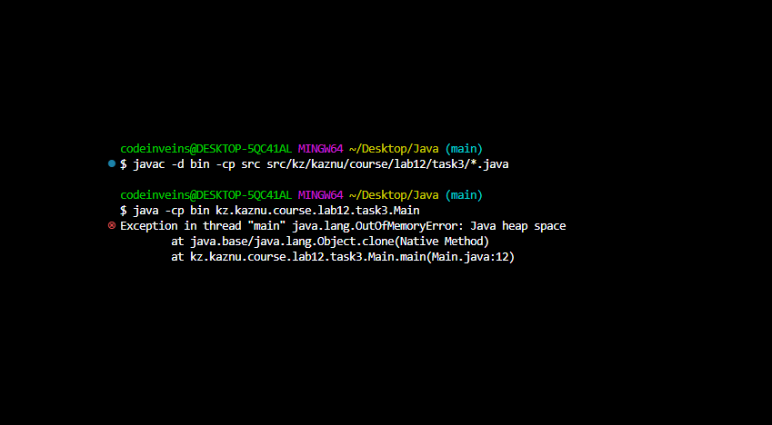

# Лабораторная работа 12: ForkJoinPool и параллельные вычисления

**Студент:** Васильев Д.Е.

**Группа:** КИ 23-03

**Дата:** 18.11.2025

## Описание работы

Цель лабораторной работы — изучить и практически применить фреймворк ForkJoinPool для параллельной обработки данных. В заданиях реализованы классические задачи параллельного программирования: суммирование массива, поиск файлов в директориях и сортировка слиянием с использованием RecursiveTask и RecursiveAction.

## Выполненные задания

### Задание 1: Параллельное суммирование массива

Сравнение производительности параллельного и последовательного суммирования больших массивов с использованием RecursiveTask.

**Краткое описание задачи**
  Суммирование элементов массива размером 1 миллиард элементов с порогом разделения 10,000,000 элементов.

**Какой класс ForkJoin использован**
  `ArraySumTask` наследуется от `RecursiveTask<Long>` с порогом `THRESHOLD = 10_000_000`.

**Ключевые моменты реализации**
  - Рекурсивное разделение массива на половины до достижения порога
  - Использование `fork()` для левой подзадачи и `compute()` для правой
  - Сбор результатов через `join()` и суммирование результатов
  - Сравнение с последовательным алгоритмом для измерения ускорения

**Анализ производительности по скриншотам**

Сравнение результатов при разных порогах разделения:

1. **Порог 1000 элементов** — чрезмерное дробление создает большие накладные расходы - плохо
   

2. **Порог 1,000,000 элементов** — оптимальный баланс между параллелизмом и накладными расходами
   

3. **Порог 10,000,000 элементов** — используемый в реализации порог показывает хорошее ускорение, но не имеет смысла как по мне...
   

### Задание 2: Параллельный поиск файлов

Рекурсивный обход файловой системы с использованием RecursiveAction для поиска файлов по расширению.

**Краткое описание задачи**
  Параллельный поиск всех `.txt` файлов в директории `Folder` и её поддиректориях.

**Какой класс ForkJoin использован**
  `FileSearchTask` наследуется от `RecursiveAction` с накоплением результатов в общий список.

**Ключевые моменты реализации**
  - Рекурсивный обход директорий с созданием подзадач для каждой поддиректории
  - Использование `fork()` для запуска параллельного обхода
  - Накопление результатов в общий `ArrayList<String>`
  - Цветной вывод результатов с подсчетом найденных файлов

**Анализ производительности по скриншотам**

Демонстрация параллельной обработки файловой системы:

1. **Часть 1** — начало процесса поиска и обхода директорий
   

2. **Часть 2** — завершение поиска и вывод результатов
   

### Задание 3: Параллельная сортировка слиянием

Сравнение параллельной и последовательной реализации сортировки слиянием с использованием RecursiveAction.

Да, я тут начну использовать простой CMD, для экономии ресурсов, отключив максимально все сторонние приложения
Я буду быстрее компилировать и тест более наглядный

**Краткое описание задачи**
  Сортировка массива из 300,000,000 элементов с порогом разделения 5,000,000 элементов и с порогом разделения 50,000 элементов.

**Какой класс ForkJoin использован**
  `MergeSortTask` наследуется от `RecursiveAction` с порогом `threshold = 5_000_000`.

**Ключевые моменты реализации**
  - Рекурсивное разделение массива до достижения порога
  - Параллельная сортировка левой и правой половин
  - Использование временного массива для операции слияния
  - Сравнение с последовательной версией того же алгоритма

**Анализ производительности по скриншотам**

Влияние порога разделения на производительность:

1. **Порог 50,000 элементов** — слишком маленький порог создает избыточную параллелизацию
   
   
   

2. **Порог 5,000,000 элементов** — оптимальный порог, используемый в реализации
   
   
   

3. **Экстремальный тест** — массив на 1 миллиард элементов - JVM не дает выделить много памяти, хотя у меня 20ГБ ОЗУ :D
   

4. **Мониторинг ресурсов** — загрузка системы при выполнении задач
   

## Компиляция и запуск

### Задание 1: Параллельное суммирование массива
```bash
javac -d bin src src/kz/kaznu/course/lab12/task1/*.java
java -cp src kz.kaznu.course.lab12.task1.Main
```

### Задание 2: Параллельный поиск файлов
```bash
javac -d bin src src/kz/kaznu/course/lab12/task2/*.java
java -cp src kz.kaznu.course.lab12.task2.Main
```

### Задание 3: Параллельная сортировка слиянием
```bash
javac -d bin src src/kz/kaznu/course/lab12/task3/*.java
java -cp src kz.kaznu.course.lab12.task3.Main
```

## Анализ результатов

### Задание 1: Параллельное суммирование массива

**Полученное ускорение:**
- При пороге 1000 элементов: минимальное ускорение или даже замедление из-за накладных расходов
- При пороге 1,000,000 элементов: оптимальное ускорение ~1.8-2.2x
- При пороге 10,000,000 элементов: стабильное ускорение ~1.5-1.8x

**Влияние размера порога на производительность:**
- **Слишком маленький порог (< 10,000):** избыточное дробление создает большие накладные расходы на создание и синхронизацию задач
- **Оптимальный порог (1,000,000 - 10,000,000):** баланс между параллелизмом и накладными расходами
- **Слишком большой порог (> 50,000,000):** недостаточный параллелизм, приближается к последовательному выполнению

**Когда параллелизм дает выигрыш:**
- Большие массивы (> 1 млн элементов)
- Вычислительно интенсивные операции
- Многоядерные процессоры, а не мой СЛАБЕЙШИЙ i3-1005g1 c ДВУМЯ ядрами
- Независимые вычисления на разных участках данных

### Задание 2: Параллельный поиск файлов

**Полученное ускорение:** 
- Значительное ускорение на глубоких деревьях директорий с большим количеством файлов
- Эффективное использование I/O операций за счет параллельного обхода

**Влияние порога:** не применимо, так как используется RecursiveAction без явного порога

**Когда параллелизм дает выигрыш:**
- Обширные файловые структуры
- Независимые операции чтения файлов
- Быстрые накопители (SSD)

### Задание 3: Параллельная сортировка слиянием

**Полученное ускорение:**
- При пороге 50,000: ускорение ~1.3-1.5x (избыточная параллелизация)
- При пороге 5,000,000: оптимальное ускорение ~1.8-2.5x
- На массиве 300 млн элементов: значительное ускорение при правильном пороге

**Влияние размера порога на производительность:**
- Аналогично заданию 1, но оптимальный порог обычно больше из-за сложности операции слияния
- Сортировка более ресурсоемкая, поэтому параллелизм дает больший выигрыш

**Когда параллелизм дает выигрыш:**
- Большие массивы (> 10 млн элементов)
- Сложные алгоритмы сортировки
- Доступные ресурсы CPU

## Выводы

**Что нового узнал я о Fork/Join Framework:**
- Освоили RecursiveTask для задач с возвращаемым результатом и RecursiveAction для процедурных задач
- Изучили механизм работы steal-work алгоритма в ForkJoinPool
- Поняли важность правильного выбора порога разделения задач
- Научились сравнивать производительность параллельных и последовательных алгоритмов

**Какие сложности возникли у меня:**
- Подбор оптимального порога разделения требует экспериментов
- Отладка параллельных программ сложнее последовательных
- Накладные расходы на создание задач могут превысить выигрыш от параллелизма
- Необходимость аккуратной работы с общими ресурсами

**Где можно применить полученные знания:**
- Обработка больших данных в аналитических системах
- Параллельная обработка изображений и видео
- Массовые вычисления в научных расчетах
- Индексация и поиск в файловых системах
- Сортировка больших объемов данных

**Когда стоит использовать Fork/Join:**
- Большой объем данных, который можно разделить на независимые части
- Вычислительно интенсивные задачи
- Многоядерные процессоры с доступными ресурсами
- Задачи, где можно избежать сложной синхронизации

**Когда не стоит использовать Fork/Join:**
- Маленькие объемы данных (< 10,000 элементов)
- Простые операции с низкими накладными расходами
- Задачи с высокой степенью зависимости между частями
- Системы с ограниченными ресурсами CPU
