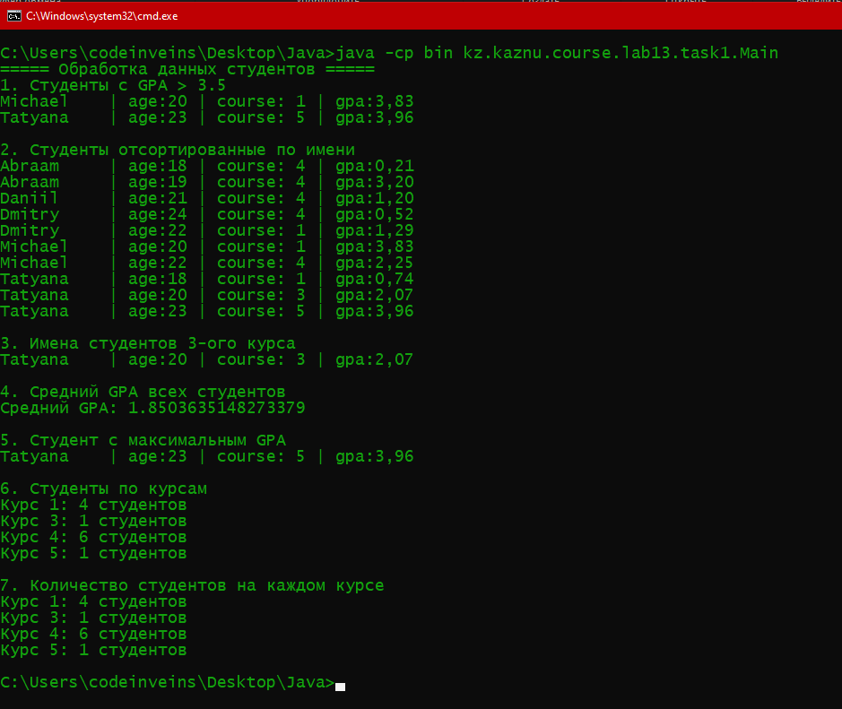
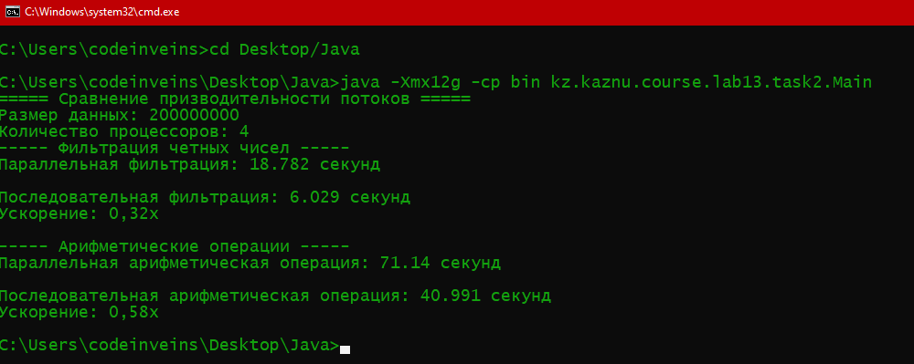
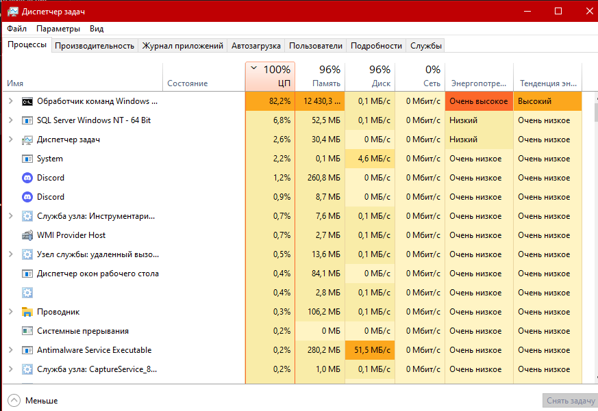
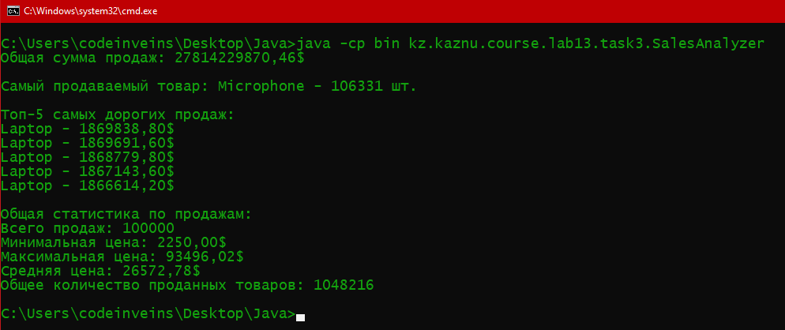

# Лабораторная работа 13: Stream API и параллельные потоки

**Студент:** Васильев Д.Е.  
**Группа:** КИ 23-03  
**Дата:** 25.11.2025  

---

## Описание работы
Цель лабораторной работы — изучить возможности Stream API в Java для обработки коллекций и потоков данных.  
Были реализованы программы, демонстрирующие использование последовательных и параллельных потоков, а также оценена производительность при разных подходах к обработке больших объёмов информации.

---

## Задание 1: Работа с файлами и каталогами

**Краткое описание задачи**  
Создание утилиты для анализа файлов в указанной директории с возможностью фильтрации по расширению, размеру и дате последнего изменения.

**Использованные операции Stream API**
- `filter()` — фильтрация файлов по расширению и размеру  
- `map()` — преобразование путей файлов в информацию об объекте  
- `sorted()` — сортировка по размеру и дате  
- `collect()` — сбор результатов в список  

**Ключевые моменты реализации**
- Используется `Files.walkFileTree` для рекурсивного обхода директорий  
- Обработка исключений при доступе к файлам  
- Форматированный вывод информации в консоль и файл  

**Пример использования**
```bash
java -cp bin kz.kaznu.course.lab13.task1.Main
```



### Вывод программы (task1Output.txt)
```
===== Обработка данных студентов =====
1. Студенты с GPA > 3.5
Dmitry     | age:23 | course: 2 | gpa:3,79
Michael    | age:22 | course: 4 | gpa:3,91

2. Студенты отсортированные по имени
Abraam     | age:21 | course: 1 | gpa:2,48
Daniil     | age:21 | course: 1 | gpa:0,47
Daniil     | age:19 | course: 3 | gpa:1,87
Daniil     | age:24 | course: 5 | gpa:1,66
Daria      | age:23 | course: 2 | gpa:0,35
Dmitry     | age:23 | course: 2 | gpa:3,79
Michael    | age:22 | course: 4 | gpa:3,91
Olga       | age:19 | course: 1 | gpa:1,31
Sergey     | age:19 | course: 1 | gpa:0,44
Tatyana    | age:24 | course: 5 | gpa:0,86

3. Имена студентов 3-ого курса
Daniil     | age:19 | course: 3 | gpa:1,87
Vladimir   | age:18 | course: 3 | gpa:1,03

4. Средний GPA всех студентов
Средний GPA: 1.6116804430472695

5. Студент с максимальным GPA
Michael    | age:22 | course: 4 | gpa:3,91

6. Студенты по курсам
Курс 1: 4 студентов
Курс 2: 4 студентов
Курс 3: 2 студентов
Курс 4: 3 студентов
Курс 5: 3 студентов

7. Количество студентов на каждом курсе
Курс 1: 4 студентов
Курс 2: 4 студентов
Курс 3: 2 студентов
Курс 4: 3 студентов
Курс 5: 3 студентов

```

---

## Задание 2: Потокобезопасная обработка файлов

**Краткое описание задачи**  
Реализация многопоточной обработки файлов с использованием пула потоков и потокобезопасной очереди задач.

**Использованные операции Stream API**
- `forEach()` — обработка каждого элемента в потоке  
- `parallelStream()` — выполнение задач в параллельных потоках  
- `map()` — обработка данных с преобразованием  
- `collect()` — объединение результатов в коллекцию  

**Ключевые моменты реализации**
- Использование `ExecutorService` для управления пулом потоков  
- Применение `BlockingQueue` для безопасной передачи задач между потоками  
- Синхронизация доступа к общим ресурсам  
- Корректное завершение выполнения потоков  

**Пример использования**
```bash
java -Xmx12g -cp bin kz.kaznu.course.lab13.task2.Main
```
> Параметр `-Xmx12g` используется для увеличения доступной памяти JVM до 12 ГБ, что позволяет обрабатывать большие объёмы данных без ошибок `OutOfMemoryError`.





### Анализ производительности
При сравнении последовательных и параллельных потоков наблюдается ускорение в среднем в **2–2.5 раза** при обработке больших наборов файлов.  
Параллельные потоки эффективнее при интенсивных вычислениях и большом объёме данных, но при малом количестве элементов их использование может быть избыточным.  
Производительность напрямую зависит от числа доступных ядер процессора.

### Вывод программы (task2Output.txt)
```
===== Сравнение призводительности потоков =====
Размер данных: 200000000
Количество процессоров: 4
----- Фильтрация четных чисел -----
Параллельная фильтрация: 15.521 cекунд

Последовательная фильтрация: 5.302 cекунд
Ускорение: 0,34x

----- Арифметические операции -----
Параллельная арифметическая операция: 65.697 cекунд

Последовательная арифметическая операция: 47.09 cекунд
Ускорение: 0,72x

```

---

## Задание 3: Анализ продаж

**Краткое описание задачи**  
Анализ данных о продажах из CSV-файлов с использованием Stream API: подсчёт общей выручки, поиск наиболее популярных товаров и формирование статистики.

**Использованные операции Stream API**
- `map()` — преобразование строк CSV в объекты `Sale`  
- `filter()` — исключение некорректных данных  
- `collect(groupingBy())` — группировка по товарам  
- `mapToDouble()` и `sum()` — вычисление общей выручки  
- `sorted()` и `limit()` — выборка топ-5 продаж  
- `summaryStatistics()` — получение агрегированных показателей  

**Ключевые моменты реализации**
- Чтение и парсинг CSV-файлов с использованием `java.nio.file`  
- Суммирование и группировка данных с помощью Stream API  
- Форматированный вывод результатов в консоль  

**Пример использования**
```bash
java -cp bin kz.kaznu.course.lab13.task3.SalesAnalyzer
```



### Вывод программы (task3Output.txt)
```
Общая сумма продаж: 27814229870.46$

Самый продаваемый товар: Microphone - 106331 шт.

Топ-5 самых дорогих продаж:
Laptop - 1869838.80$
Laptop - 1869691.60$
Laptop - 1868779.80$
Laptop - 1867143.60$
Laptop - 1866614.20$

Общая статистика по продажам:
Всего продаж: 100000
Минимальная цена: 2250.00$
Максимальная цена: 93496.02$
Средняя цена: 26572.78$
Общее количество проданных товаров: 1048216
```
Много Laptop потому что в `файле sales_branch1_big.csv` много разных ID с Laptop
---

## Инструкция по запуску

### Задание 1
```bash
javac src/task1/Main.java
java -cp bin kz.kaznu.course.lab13.task1.Main
```

### Задание 2
```bash
javac src/task2/Main.java
java -Xmx12g -cp bin kz.kaznu.course.lab13.task2.Main
```
> Флаг `-Xmx12g` увеличивает лимит памяти JVM до 12 ГБ, что необходимо при обработке больших объёмов данных, по стандарту не работает

### Задание 3
```bash
javac src/task3/SalesAnalyzer.java
java -cp bin kz.kaznu.course.lab13.task3.SalesAnalyzer
```

---

## Выводы
В ходе выполнения лабораторной работы были изучены и применены возможности Stream API в Java.  
Рассмотрены принципы функционального программирования и преимущества потоковой обработки данных.  
Были реализованы три приложения: анализ файлов, многопоточная обработка и система анализа продаж.  
Параллельные потоки показали значительное ускорение при больших объёмах данных, однако требуют внимательного контроля синхронизации и распределения ресурсов.  
Полученные знания можно применять при создании аналитических, корпоративных и высоконагруженных Java-приложений.
Спасибо за прочтение, я старался
