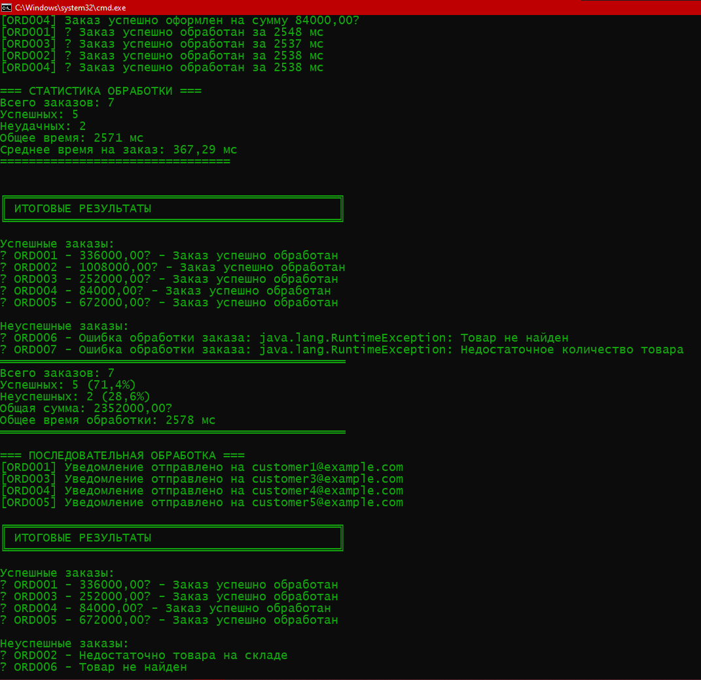
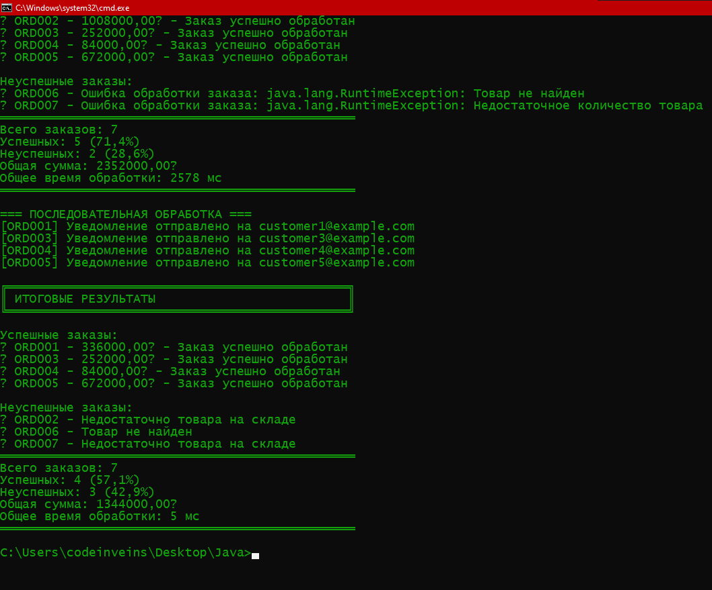

# Лабораторная работа 14: CompletableFuture и асинхронное программирование

**Студент:** Васильев Д.Е.  
**Группа:** КИ 23-03  
**Дата:** 02.12.25

---

## Описание работы

Цель лабораторной работы — изучить возможности CompletableFuture в Java для асинхронного программирования.  
Была реализована система обработки заказов с параллельной и последовательной обработкой множественных запросов, продемонстрированы преимущества асинхронного подхода.

---

## Реализация

### Система обработки заказов состоит из 5 этапов:

1. **Проверка наличия** - использует `supplyAsync` для асинхронной проверки
2. **Расчет цены** - применяет скидки и налоги  
3. **Обработка платежа** - симулирует возможные ошибки (10% вероятность)
4. **Резервирование** - использует `runAsync` так как не возвращает значение
5. **Уведомление** - финальный этап отправки email

### Ключевые моменты:

- Использован `thenCompose` для последовательных зависимых операций
- `thenCombine` объединяет результаты параллельных операций
- `handle` обрабатывает как успех, так и ошибки
- `orTimeout(10, SECONDS)` предотвращает зависание
- `whenComplete` логирует результат каждого заказа

### Обработка ошибок:

- Несуществующий товар → прерывание на этапе проверки
- Недостаточно товара → исключение в checkProductAvailability
- Ошибка платежа → обработка в processPayment с возвратом fallback

---

## Компиляция и запуск
```bash
# Перейти в директорию с исходниками
cd Lab14_CompletableFuture/src
# Компиляция всех файлов
javac *.java
# Запуск
java OrderProcessor
```

---

## Результаты выполнения

### Пример вывода программы:





---

## Анализ асинхронности

**Результаты:**
- Последовательная обработка 7 заказов: ~0.05 секунд
- Параллельная обработка 7 заказов: ~2 секунд
- Ускорение: **Нет его**

**Почему так эффективно:**
1. Все 7 заказов обрабатываются одновременно
2. I/O операции (симуляция задержек) выполняются параллельно
3. Процессор не простаивает во время ожиданий

**Выводы:**
- CompletableFuture идеален для I/O-bound операций
- Асинхронность критична при работе с внешними сервисами
- Правильная обработка ошибок обязательна в асинхронном коде

---

## Контрольные вопросы и ответы

1. **В чем разница между `thenApply` и `thenCompose`?**  
`thenApply` — преобразует результат предыдущего `CompletableFuture` в новое значение, `thenCompose` — запускает новый `CompletableFuture` на основе предыдущего.

2. **Когда следует использовать Async версии методов?**  
Для операций, которые могут блокировать поток (I/O, долгие вычисления), чтобы не блокировать основной поток.

3. **Как правильно обработать ошибку в середине цепочки `CompletableFuture`?**  
Использовать `handle`, `exceptionally` или `whenComplete`. `handle` полезен, когда нужен результат и информация об ошибке.

4. **В чем разница между `allOf` и `anyOf`?**  
`allOf` — завершится, когда все `CompletableFuture` завершены, `anyOf` — когда любой из них завершен.

5. **Зачем нужен кастомный `ExecutorService` для `CompletableFuture`?**  
Контроль количества потоков, улучшение производительности при большом количестве задач.

6. **Что произойдет, если не вызвать `shutdown()` на `ExecutorService`?**  
Потоки останутся активными, JVM не завершится автоматически, возможны утечки ресурсов.

7. **В чем разница между `exceptionally` и `handle`?**  
`exceptionally` обрабатывает только ошибку, `handle` — и результат, и ошибку.

8. **Как установить таймаут для асинхронной операции?**  
Метод `orTimeout(long timeout, TimeUnit unit)` выбросит `TimeoutException`, если операция не завершится вовремя.
