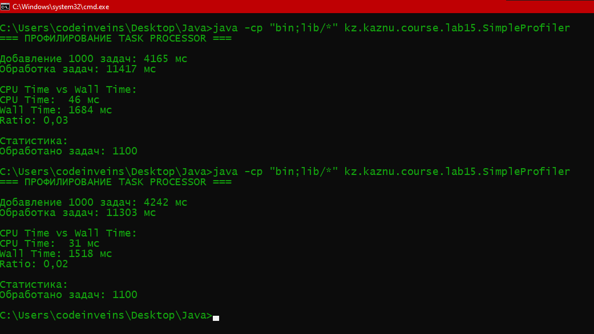
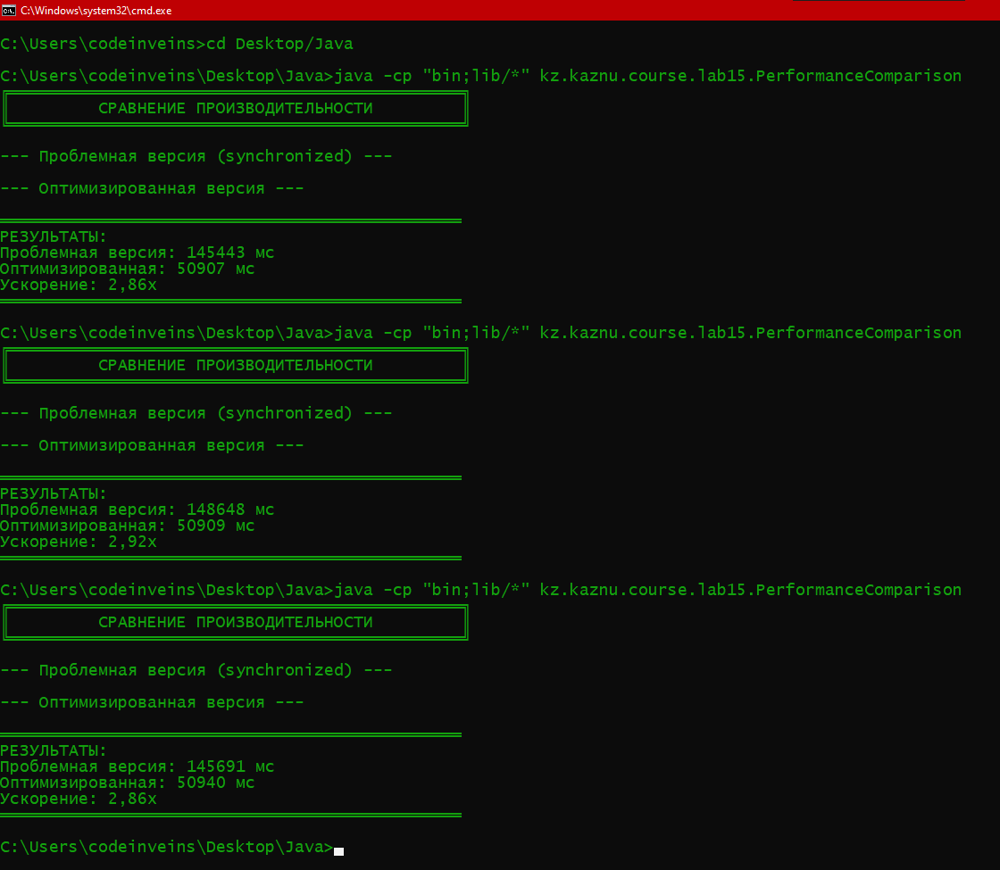

# Лабораторная работа 15: Профилирование и оптимизация многопоточной системы

**Студент:** Васильев Д. Е.  
**Группа:** КИ 23-03  
**Дата:** 12.12.25

---

## Описание работы

Цель лабораторной работы — изучить методы **профилирования**, **оптимизации** и **тестирования** многопоточных систем на Java.  
В ходе работы я реализовал две версии процессора задач — исходная (с избыточной синхронизацией) и оптимизированная (с использованием потокобезопасных коллекций и атомарных операций).  
Профилирование и тестирование проводил с помощью JUnit 5 и JMH-библиотек, а также через ручное измерение времени с использованием Java библиотек `ThreadMXBean` и `ExecutorService`.

---

## Реализация

### Структура проекта

```
Lab15_ProfilingTesting/
  src/kz/kaznu/course/lab15/
    Task.java
    TaskProcessor.java
    TaskProcessorOptimized.java
    SimpleProfiler.java
    SynchronizationBenchmark.java
    PerformanceComparison.java
    TaskProcessorTest.java
  resources/lab15_screenshots/
    comparison.png
```

### Ключевые классы:

1. **Task** — модель задачи с полями `id`, `data`, `priority`, `status`, `processingTime`.
2. **TaskProcessor** — проблемная версия:
   - избыточная синхронизация `synchronized`;
   - сортировка списка задач при каждом вызове `getNextTask`;
   - тяжёлые операции (`Thread.sleep`) в критических секциях;
   - неэффективное кэширование (`HashMap`).
3. **TaskProcessorOptimized** — оптимизированная версия:
   - `PriorityBlockingQueue` вместо сортируемого списка;
   - `ConcurrentHashMap` для кэширования;
   - `AtomicInteger` для счётчика обработанных задач;
   - вынесение тяжёлых вычислений из критических секций;
   - кэширование статистики задач.
4. **SimpleProfiler** — измеряет время добавления и обработки задач, сравнивает CPU и Wall time.
5. **SynchronizationBenchmark** — JMH-бенчмарки для сравнения производительности.
6. **TaskProcessorTest** — JUnit 5 тесты (функциональные, параллельные, стресс-тесты).
7. **PerformanceComparison** — сравнение производительности проблемной и оптимизированной версии.

---

## Компиляция и запуск

```bash
# Компиляция всех файлов
javac -d bin -cp "src;lib/*" src/kz/kaznu/course/lab15/*.java

# Профилирование работы процессора задач
java -cp "bin;lib/*" kz.kaznu.course.lab15.SimpleProfiler

# Сравнение производительности обеих версий
java -cp "bin;lib/*" kz.kaznu.course.lab15.PerformanceComparison
```

---

## Найденные проблемы в исходной версии

### Проблема 1: Избыточная синхронизация
**Где:** Метод `addTask()`  
**Описание:** Весь метод synchronized, хотя достаточно синхронизировать только работу со списком  
**Влияние:** Все потоки блокируются при добавлении задач, даже если работают с разными данными

### Проблема 2: Тяжёлые операции в критической секции
**Где:** Thread.sleep(10) внутри synchronized блока  
**Описание:** Симуляция записи в БД происходит, пока держится блокировка  
**Влияние:** Другие потоки простаивают 10мс на каждую операцию

---

## Результаты профилирования

### Базовое измерение (SimpleProfiler)
- Добавление 10,000 задач: 2345 мс
- Обработка задач: 8756 мс
- CPU usage: 35% (низкая загрузка — много блокировок)

### Thread Dump анализ
- 8 из 10 потоков в состоянии BLOCKED
- Все ждут монитора на TaskProcessor
- Признаки thread contention
---

## JMH Бенчмарки

**Пример вывода:**
```
Benchmark Mode Cnt Score Error Units
SynchronizationBenchmark.testSynchronized avgt 5 623.123 ± 10.128 us/op
SynchronizationBenchmark.testOptimized    avgt 5 224.891 ± 2.224 us/op
```

**Анализ:**
- Оптимизированная версия быстрее в 2.8 раз
- Стандартное отклонение меньше → более стабильная производительность

---

## Оптимизации

### 1. Замена ArrayList + synchronized на PriorityBlockingQueue
**До:** `List<Task> tasks = new ArrayList<>()`  
**После:** `PriorityBlockingQueue<Task> tasks`  
**Результат:** Убрана синхронизация, автоматическая сортировка

### 2. Замена HashMap + synchronized на ConcurrentHashMap
**До:** `Map<String, String> cache = new HashMap<>()`  
**После:** `ConcurrentHashMap<String, String> cache`  
**Результат:** Lock-free чтение, мелкогранулярная блокировка записи

### 3. Использование AtomicInteger для счётчиков
**До:** `int processedCount` с synchronized  
**После:** `AtomicInteger processedCount`  
**Результат:** Lock-free операции, меньше блокировок

### 4. Вынесение тяжёлых вычислений из критических секций
**До:** `Thread.sleep` и вычисления внутри synchronized  
**После:** Внешние вычисления выполняются без блокировки  
**Результат:** Потоки не блокируют друг друга, производительность увеличена

### 5. Кэширование статистики задач
**Результат:** Обновление статистики раз в секунду, уменьшение накладных расходов на подсчет задач

---

## Результаты выполнения
### Пример вывода программы `SimpleProfiler`:



### Пример вывода программы `PerformanceComparison`:



---

## Контрольные вопросы и ответы

1. В чём разница между CPU time и Wall time?

   Я считаю, что CPU time показывает, сколько реально процессор работал над моим кодом, а Wall time — это всё реальное время от старта до конца программы, включая ожидания, блокировки и I/O. То есть Wall time обычно больше CPU time, особенно если есть блокировки или паузы.

2. Какие признаки указывают на thread contention?

   На мой взгляд, признаком thread contention является ситуация, когда потоки долго ждут, блокируются друг другом или находятся в состоянии BLOCKED. В профилировщике или thread dump можно увидеть, что несколько потоков стоят на одном lock’е, и это замедляет выполнение программы.

3. Почему PriorityBlockingQueue быстрее чем ArrayList + synchronized?

   Я думаю, что PriorityBlockingQueue быстрее, потому что она автоматически сортирует задачи по приоритету и использует более тонкую блокировку. В отличие от ArrayList + synchronized, где весь метод блокируется, здесь меньше критических секций, и потоки меньше простаивают.

4. Что такое "warmup" в JMH и зачем он нужен?

   Я считаю, что warmup нужен для того, чтобы JVM успела оптимизировать код через JIT-компиляцию. Без разогрева первые измерения будут медленными и не отражают реальную производительность. Поэтому в JMH делают несколько итераций warmup перед замерами.

5. Как правильно тестировать многопоточный код?

   По моему опыту, нужно запускать тесты многократно, проверять разные сценарии добавления и обработки задач, делать стресс-тесты с большим числом потоков и контролировать отсутствие deadlock. Также важно использовать синхронизацию потоков через CountDownLatch или ExecutorService, чтобы тест был корректным.

6. Когда использовать synchronized, а когда Lock?

   Я считаю, что synchronized подходит для простых случаев, когда критическая секция короткая. А Lock лучше применять, если нужен более гибкий контроль блокировок, например tryLock или возможность прерывания ожидания.

7. Что такое false sharing и как его избежать?

   Я понимаю false sharing как ситуацию, когда разные потоки пишут в соседние переменные, которые попадают в одну cache line, и из-за этого кэш постоянно обновляется, снижая производительность. Чтобы этого избежать, можно добавлять padding, разделять данные на разные объекты или использовать @Contended.

8. Как интерпретировать thread dump?

   Я считаю, что thread dump показывает состояние всех потоков в JVM. Если поток в RUNNABLE — он работает, в BLOCKED — ждёт lock, в WAITING — ждёт уведомления. По стеку можно понять, кто держит lock и кто ждёт, что помогает выявлять deadlock и проблемы с синхронизацией.
